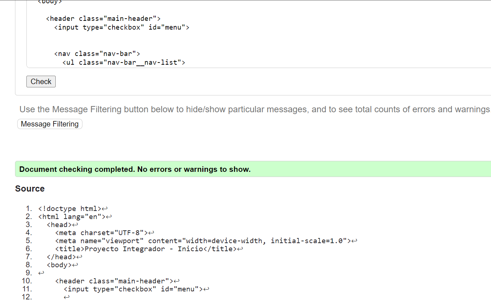
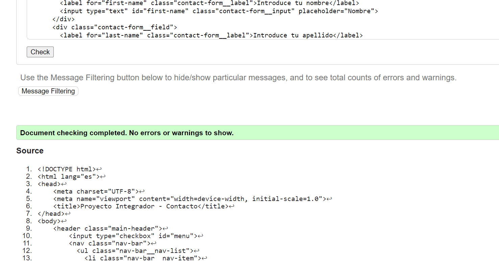
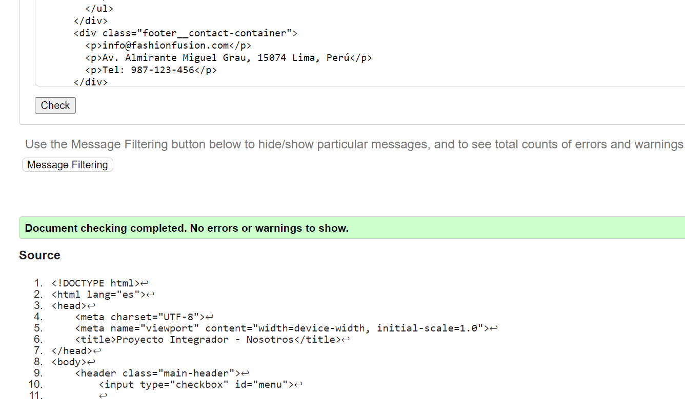

# Proyecto Integrador Fase 1

## Mariajulia Romani Tafur

Este drive contiene los archivos relacionados con el Proyector Integrador

### Enlace a la implementación en Netlify

Puedes acceder a la implementación del proyecto fase 1:
[Netlify](https://storied-salmiakki-2085be.netlify.app).

Publicado en: https://storied-salmiakki-2085be.netlify.app
[Netlify](https://storied-zabaione-86b290.netlify.app/).

### Captura de pantalla al validator w3

Tras pasar el index por el validador, todo indico que está correcto.

- Validación de la página de inicio

- Validación de la página de contacto

- Validación de la página de nosotros

